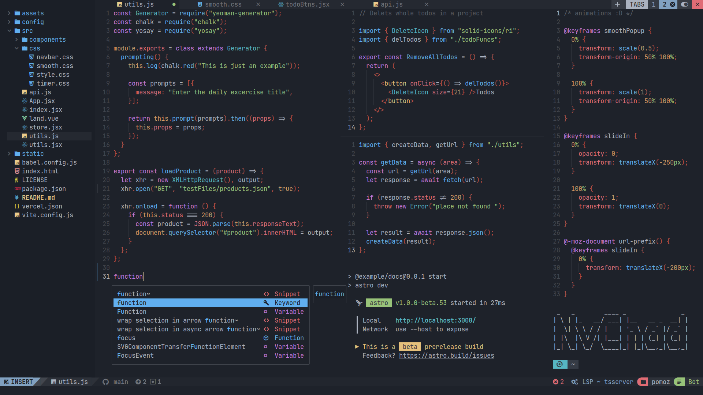
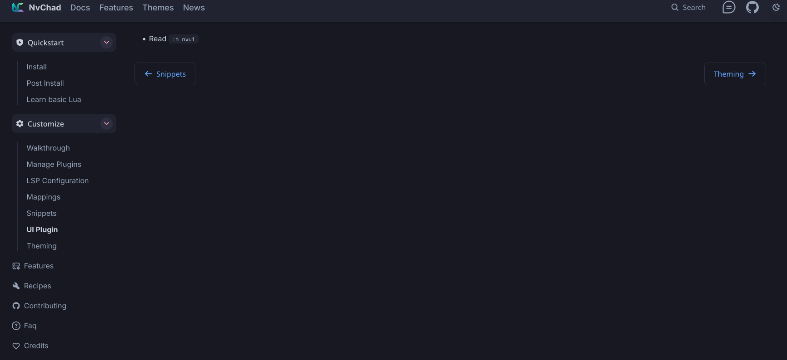

I love it when names have a deeper meaning behind them, both linguistically and
conceptually. Those etymology charts in online dictionaries always fascinated
me, like little maps of interpretation. Conceptually, I have SCP-4000 to thank
for my love of name-based magic. Oh, sorry I meant to say
THAT ONE PLACE WITH THE FAIRIES IN
A FOREST THAT CAN'T BE REFERRED TO WITH THE SAME NAME TWICE.

But as you've probably guessed, today I want to talk about something named so
literally I can't help but love it. There's nothing to read into, nothing to
extract hidden meaning from. It's as subtle as a sledgehammer and as elegant as
a cinder-block. Dotfiles are called that because hidden items in a file manager
are prefixed with a period. Personally, this radical simplicity is a breath of
fresh air. Not just the name, but hiding sensitive files behind such a
straightforward barrier. Windows requires you to type out `%appdata%` every
single time, and sometimes it's in `%localappdata%` or the Documents folder or
some other app-specific folder. I've been confused by Linux's lack of a "Program
Files" folder but it's worth it if I can find the files I'll actually edit.

The main strength of Linux has always been its customization, but that
inevitably scares off people don't care. It's like that old community in-joke:
"The best part of Linux is that you can customize anything, the worst part of
Linux is that you _have to_ customize _everything_". Thankfully, the existence
of a dotfiles folder partially negates this potential hurdle by making it
trivial to copy someone else's setup. Which brings me to the reason I wanted to
make this post, and the software I'm currently writing in...

##  Neovim

Neovim is a heavily refactored fork of
[Vim](<https://en.wikipedia.org/wiki/Vim_(text_editor)>) , which was a clone of
[VI](<https://en.wikipedia.org/wiki/Vi_(text_editor)>), which was the visual
mode of a command line text editor called
[EX](<https://en.wikipedia.org/wiki/Ex_(text_editor)>), which was an optimized
version of [ED](<https://en.wikipedia.org/wiki/Ed_(software)>), which was a Unix
port of [QED](<https://en.wikipedia.org/wiki/QED_(text_editor)>)[^1]. This is
relevant because beyond modernizing an ancient program, Neovim was designed for
extensibility. Fitting considering how far back its roots stretch. And make no
mistake, those roots are still there. EX was a complete rewrite, so only design
decisions remain from ED and QED, but beyond that? There's C code from the 70's
running under the hood, providing the exact same functionality it did back then.
Imagine if all software preservation was this easy! No emulation, no
compatibility layers, no nothing, just CPU instructions triggered on key press.

[^1]: Which stands for Quick EDitor, if you were wondering.

Anyway, the point of going over Neovim's dumb-as-bricks foundations was to show
how easily dotfiles can transform a program into something unrecognizable (and
if you aren't careful, something far less usable). As tempting as it is to copy
and paste someone else's setup, it really pays off to know the ins and outs of
whatever program you're configuring. That's always the tradeoff, technical
experience is never "optional", it just might take a while before it becomes
mandatory. Neovim's extensibility means that pre-configured setups aren't just
appealing, they're almost required. Thankfully, someone smarter than me _also_
noticed this and created a set of dotfiles that pulls double-duty as both a
functional configuration of Neovim, and an annotated guide to every part of the
program.

### Kickstart.nvim

[Kickstart.nvim](https://github.com/nvim-lua/kickstart.nvim) is a Neovim
configuration that I think everyone should use, at least to start with. A common
sentiment from more technically experienced folks towards new users is RTFM, or
Read The Fucking Manual. Back when you installed software from physical media,
this was more or less the expectation. No Clippy, no labels or visible keymaps,
you were just expected to spend a week going through >100 pages of technical
documentation covering every single function and use case. Kickstart.nvim
preserves some of this philosophy by heavily relying on the <kbd>leader</kbd> +
<kbd>s</kbd> + <kbd>h</kbd> command, which pulls up a search box that scrubs the
built-in manual for more detailed documentation on whatever you might need help
with. The only "required reading" is presented in a simple, no-frills, Mike
Ehrmantraut "Here's what you're gonna do" format.

> [!tip]
>
> So here's what you're gonna do. You're gonna go to Kickstart.nvim's GitHub
> page. You're gonna fork the repository, just like it tells ya. You're gonna
> install the dependencies listed in the README, doesn't matter which OS you're
> on, there's options for all of 'em. You're gonna find your Neovim config
> folder and clone your forked repository right in there, nice and clean. You're
> gonna open up your favorite terminal and type "nvim", if any errors pop up,
> you mucked something up. No big deal, just go back to the README and make sure
> you did every step just like it told ya. You're gonna keep doing that, and
> once you're done, you're gonna type ":Tutor". You're gonna do what it says
> until you got a basic grasp on Vim-style editing. Once you're confident in
> that department, you're gonna type ":e $MYVIMRC". From there, you read what it
> tells you, write it down if you have to, just pay attention and restart after
> any changes to avoid pouring over every line looking for which one caused an
> error. You got all that?

Well you better have, because up next are the advanced setups with a ton of
pre-configured features that are definitely more usable out of the box, but work
best as examples or inspiration, not an all-in-one shortcut.

### NVChad

A wildly popular choice, NVChad has a lot going for it. It's beautiful, for one
thing. It's clear a lot of work was put into their custom base46 theming plugin.
Their custom UI plugin as a whole does a lot of work in turning Neovim into
something that _looks_ like an IDE. Let's see the docs page for it!

Oh... That's helpful. Well what about base46? The theming plugin must have some
stuff about custom themes and whatnot, right?

Huh.

This is very much a "me thing" but this docs page really turned me off on
NVChad. The use of custom plugins for basic features is cool to see, they very
much do what they're supposed to, but it also reminds me of the walled gardens I
turned to Neovim to avoid. If you want to get base46 working with any other
plugin, you'll find that NVChad doesn't mix well with anything but itself. This,
to be clear, is totally fine on its own. NVChad already provides more than
enough, and I can say you'll have a fine experience even if you only use default
plugins. It's just not for me.

> [!note]
>
> This is a callout section that works in neovim, but it might not work in Astro

> [!important]
>
> This one's pretty real fr fr

> [!caution]
>
> DON'T DO THIS NO

> [!warning]
>
> DON'T DO THIS EITHER NONOONONONONONONONONONONONO

> [!tip]
>
> don't do this ever okay?
